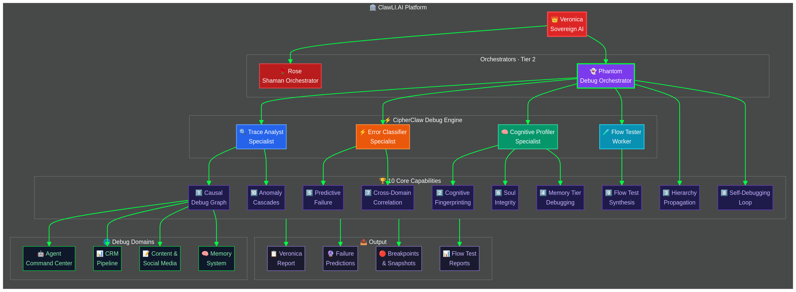
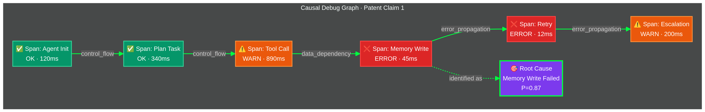
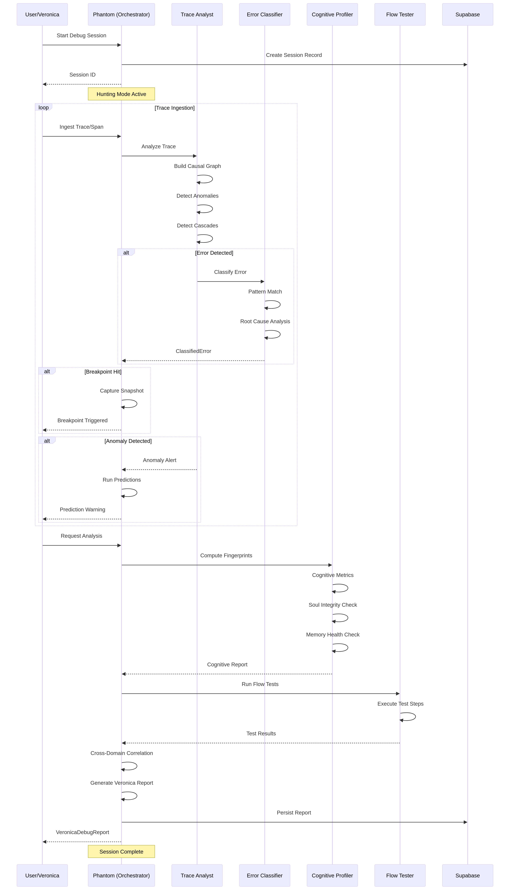

<p align="center">
  
</p>

<h1 align="center">CipherClaw</h1>

<p align="center">
  <strong>The World's First OpenClaw Bug Hunter AI Agent</strong><br/>
  <em>An open-source, AI-powered security agent that hunts down vulnerabilities in your code.</em><br/>
  <sub>Originally built for <a href="https://clawli.ai">Clawli AI</a>. Released as open source for the <a href="https://openclaw.ai">OpenClaw Ecosystem</a>.</sub>
</p>

<p align="center">
  <a href="#quick-start">Quick Start</a> ·
  <a href="#what-it-does">What It Does</a> ·
  <a href="#openclaw-skill">OpenClaw Skill</a> ·
  <a href="#api-reference">API Reference</a> ·
  <a href="docs/ARCHITECTURE.md">Architecture</a> ·
  <a href="docs/INNOVATIONS.md">Innovations</a> ·
  <a href="CONTRIBUTING.md">Contributing</a>
</p>

<p align="center">
  <a href="https://github.com/Alexi5000/CipherClaw/actions/workflows/ci.yml"></a>
  <a href="https://www.npmjs.com/package/cipherclaw"></a>
  <a href="LICENSE"></a>
  
  
  
  
</p>

---

## The Problem

You're running a swarm of OpenClaw agents. Something breaks. You open your trace viewer and see 400 spans across 12 agents, 3 domains, and 5 memory tiers. Good luck.

Existing debug tools were built for single-agent chains. They show you a flat list of spans and call it a day. That's fine when you have one agent calling one tool. It falls apart the moment you have agents delegating to agents, writing to shared memory, and operating across CRM, content, and infrastructure domains simultaneously.

CipherClaw was built for this world. It's an autonomous debug agent that joins your OpenClaw system as a peer, communicates through the event bus, respects agent hierarchy, and does the actual debugging work — not just the observability part.

## What It Does

CipherClaw ships 10 capabilities that go beyond what trace viewers offer. Each one is independently tested and verified.

| Capability | What It Actually Does |
|-----------|----------------------|
| **Causal Debug Graph** | Builds a DAG from your traces and scores root cause probability. Stops you from chasing symptoms. |
| **Cognitive Fingerprinting** | Profiles each agent's behavior across 8 dimensions. Detects when an agent starts acting differently. |
| **Hierarchy Propagation** | Routes debug events up, down, and laterally through your agent command structure. Parent agents know when children fail. |
| **Memory Tier Debugging** | Analyzes health across working, short-term, episodic, semantic, and archival memory. Finds stale data and retrieval failures. |
| **Predictive Failure** | Uses 6 pattern recognizers to predict failures before they happen. Catches error rate spikes, token budget exhaustion, and cascade risks. |
| **Soul Integrity** | Checks whether agents are staying true to their defined personality and values. Detects drift over time. |
| **Cross-Domain Correlation** | Finds shared failure patterns across agent, CRM, content, and infrastructure domains. One broken API can cascade everywhere. |
| **Self-Debugging** | CipherClaw monitors its own operation. If the debugger has a bug, it catches that too. |
| **Flow Test Synthesis** | Generates integration tests from observed execution traces. Your production runs become your test suite. |
| **Anomaly Cascade Detection** | Identifies when multiple anomalies cluster in time, indicating a cascading failure rather than isolated incidents. |

For the full technical deep-dive, see [ARCHITECTURE.md](docs/ARCHITECTURE.md). For the research behind these approaches, see [INNOVATIONS.md](docs/INNOVATIONS.md).

---

## Quick Start

### Install

```bash
npm install cipherclaw
# or
pnpm add cipherclaw
```

### Use

```typescript
import { createCipherClaw } from 'cipherclaw';

const cc = createCipherClaw();

// Start a debug session
const session = cc.startSession({ domain: 'agent' });

// Feed it traces from your agent system
cc.ingestTrace({
  id: 'trace-001',
  sessionId: session.id,
  agentId: 'my-agent',
  domain: 'agent',
  startTime: Date.now() - 5000,
  endTime: Date.now(),
  status: 'error',
  spans: [
    {
      id: 'span-1',
      traceId: 'trace-001',
      name: 'agent.plan',
      category: 'planning',
      startTime: Date.now() - 5000,
      endTime: Date.now() - 3000,
      durationMs: 2000,
      status: 'ok',
      agentId: 'my-agent',
      domain: 'agent',
      metadata: {},
      events: [],
    },
    {
      id: 'span-2',
      traceId: 'trace-001',
      name: 'agent.tool_call',
      category: 'action',
      startTime: Date.now() - 3000,
      endTime: Date.now(),
      durationMs: 3000,
      status: 'error',
      agentId: 'my-agent',
      domain: 'agent',
      metadata: { error: 'Tool timeout' },
      events: [{ type: 'error', message: 'Tool execution timed out', timestamp: Date.now() }],
    },
  ],
});

// Ask it questions
const error = cc.classifyError('Tool execution timed out');
console.log(error.module);       // 'action'
console.log(error.severity);     // 'high'
console.log(error.suggestedFix); // 'Increase tool timeout or add retry logic'

// Get the causal graph — who caused what
const graph = cc.getCausalGraph();
console.log(graph?.rootCauses.length); // root cause nodes

// Behavioral fingerprint — is this agent acting normal?
const fp = cc.computeCognitiveFingerprint('my-agent');
console.log(fp.driftScore); // 0 = stable, higher = drifting

// Predict what's about to break
const predictions = cc.getPredictions();
predictions.forEach(p => {
  console.log(`${p.predictedFailure}: ${(p.confidence * 100).toFixed(0)}%`);
});

// Full health report
const report = cc.generateReport();
console.log(`Health: ${report.healthScore}/100`);

cc.completeSession();
```

---

## OpenClaw Skill

CipherClaw is a standard OpenClaw skill. Drop it into your `~/.openclaw/skills/` directory or install via ClawHub.

### SKILL.md

```yaml
---
name: cipherclaw
description: Debug agent that traces causes, profiles behavior, and predicts failures in agent swarms.
user-invocable: true
---
```

### Programmatic Integration

```typescript
import { CIPHERCLAW_MANIFEST, createCipherClaw } from 'cipherclaw';

// The manifest describes CipherClaw to any OpenClaw gateway
console.log(CIPHERCLAW_MANIFEST.name);    // 'cipherclaw'
console.log(CIPHERCLAW_MANIFEST.agents);  // 5 agents
console.log(CIPHERCLAW_MANIFEST.skills);  // 10 skills
console.log(CIPHERCLAW_MANIFEST.tools);   // 14 tools
console.log(CIPHERCLAW_MANIFEST.events);  // 12 events

// Subscribe to real-time debug events
const cc = createCipherClaw();
cc.on('error-classified', (e) => console.log(e.payload.module));
cc.on('anomaly-detected', (e) => console.log(e.payload.type));
cc.on('prediction-generated', (e) => console.log(e.payload.confidence));
cc.on('soul-drift-detected', (e) => console.log(e.payload.driftScore));
```

### Agent Hierarchy

When running inside an OpenClaw system, CipherClaw operates as an orchestrator-level agent (Phantom) with specialized sub-agents:

```
Your Sovereign Agent
├── Your Other Orchestrators
└── Phantom (CipherClaw Debug Orchestrator)
    ├── Trace Analyst — ingests and correlates traces
    ├── Error Classifier — categorizes and scores errors
    ├── Cognitive Profiler — fingerprints agent behavior
    └── Flow Tester — synthesizes and runs integration tests
```

<p align="center">
  
</p>

---

## How It Works

### Causal Debug Graph

Instead of showing you a flat trace, CipherClaw builds a directed acyclic graph of error propagation. Each node is scored with root cause probability so you know where to look first.

<p align="center">
  
</p>

### Debug Session Lifecycle

A session moves through 6 phases: init → ingest → analyze → test → report → complete. Each phase emits events that other agents in your system can subscribe to.

<p align="center">
  
</p>

---

## API Reference

### Factory

```typescript
const cc = createCipherClaw({
  maxTraces: 10000,              // max traces per session
  anomalyThresholdStdDev: 2.5,  // z-score threshold for anomaly detection
  cascadeWindowMs: 30000,        // time window for cascade grouping
  soulDriftThreshold: 15,        // drift alert threshold (0-100)
  enableSelfDebug: true,         // recursive self-monitoring
  enableHierarchyPropagation: true,
});
```

### Sessions

| Method | Returns |
|--------|---------|
| `startSession(opts?)` | `DebugSession` |
| `completeSession(id?)` | `DebugSession` |
| `getSession(id?)` | `DebugSession` |
| `getAllSessions()` | `DebugSession[]` |
| `pauseSession(id?)` | `void` |
| `resumeSession(id?)` | `void` |

### Ingestion

| Method | Returns |
|--------|---------|
| `ingestTrace(trace, id?)` | `void` |
| `ingestSpan(span, id?)` | `void` |

### Analysis

| Method | What It Does |
|--------|-------------|
| `classifyError(msg, span?, id?)` | Classifies an error by module, severity, and suggested fix |
| `getCausalGraph(id?)` | Returns the causal debug graph for the session |
| `getRootCauses(id?)` | Returns root cause nodes sorted by probability |
| `computeCognitiveFingerprint(agentId, id?)` | Profiles agent behavior across 8 dimensions |
| `analyzeSoulIntegrity(agentId, soul, behavior, id?)` | Checks personality and value adherence |
| `analyzeMemoryHealth(state, id?)` | Analyzes health across 5 memory tiers |
| `detectAnomalies(spans, id?)` | Statistical anomaly detection on span data |
| `detectCrossDomainCorrelations(id?)` | Finds shared failures across domains |
| `getPredictions(id?)` | Returns predicted failures with confidence scores |
| `propagateDebugEvent(event, id?)` | Routes a debug event through agent hierarchy |
| `selfDebug()` | Runs self-diagnostics on the engine |
| `synthesizeFlowTest(traceId, id?)` | Generates an integration test from a trace |
| `runFlowTests(domain?, id?)` | Runs all flow tests for a domain |

### Breakpoints

| Method | Returns |
|--------|---------|
| `addBreakpoint(type, condition?, meta?, id?)` | `Breakpoint` |
| `removeBreakpoint(bpId, id?)` | `void` |
| `toggleBreakpoint(bpId, id?)` | `void` |
| `getSnapshots(id?)` | `StateSnapshot[]` |
| `replayToSnapshot(snapId, id?)` | `StateSnapshot` |

11 breakpoint types: `on_error`, `on_tool_call`, `on_iteration`, `on_span_category`, `on_agent`, `on_memory_op`, `on_cost_threshold`, `on_token_threshold`, `on_latency`, `on_pipeline_stage`, `conditional`.

### Events

| Event | When |
|-------|------|
| `session-started` | New session begins |
| `session-completed` | Session completes |
| `error-classified` | Error classified |
| `anomaly-detected` | Anomaly found |
| `cascade-detected` | Cascade identified |
| `prediction-generated` | Failure predicted |
| `breakpoint-hit` | Breakpoint triggered |
| `soul-drift-detected` | Personality drift |
| `cognitive-drift-detected` | Behavioral drift |

---

## Tests

206 tests. No mocks. No stubs. Every test runs against the real engine.

```bash
pnpm test
```

| Suite | Count | What It Covers |
|-------|-------|---------------|
| Unit — Core Capabilities | 66 | All 10 capabilities with edge cases |
| End-to-End — Sessions | 65 | Full lifecycle across all domains |
| Smoke — API Surface | 75 | Every public method and event |

---

## Platforms

| Runtime | Status |
|---------|--------|
| Node.js 18+ | Tested |
| Deno | Compatible (ESM) |
| Bun | Compatible |
| Browser | Compatible (tree-shakeable) |
| Any OpenClaw system | Plug and play |

Zero runtime dependencies. Pure TypeScript.

---

## Project Structure

```
CipherClaw/
├── src/
│   ├── index.ts              # all exports
│   ├── types/index.ts        # 40+ interfaces
│   ├── core/
│   │   ├── engine.ts         # thin orchestrator (~300 lines)
│   │   ├── anomaly-detector.ts
│   │   ├── breakpoints.ts
│   │   ├── causal-graph.ts
│   │   ├── cognitive-profiler.ts
│   │   ├── cross-domain.ts
│   │   ├── error-classifier.ts
│   │   ├── flow-runner.ts
│   │   ├── flow-tests.ts
│   │   ├── hierarchy-propagation.ts
│   │   ├── memory-debugger.ts
│   │   ├── patterns.ts
│   │   ├── predictive-engine.ts
│   │   ├── report-generator.ts
│   │   ├── self-debug.ts
│   │   ├── snapshots.ts
│   │   ├── soul-monitor.ts
│   │   └── utils.ts
│   └── openclaw/
│       ├── manifest.ts       # OpenClaw skill manifest
│       └── adapter.ts        # event bus adapter
├── docs/
│   ├── ARCHITECTURE.md       # technical deep-dive
│   ├── INNOVATIONS.md        # novel approaches
│   ├── assets/               # logo, banner
│   └── diagrams/             # .mmd sources + .png renders
├── skills/
│   └── cipherclaw/
│       ├── SKILL.md          # OpenClaw skill definition
│       └── SOUL.md           # Phantom agent soul
├── AGENTS.md                 # build/test/lint instructions
├── CLAUDE.md                 # symlink → AGENTS.md
└── src/__tests__/            # 206 tests
```

---

## Contributing

Contributions are welcome. See [CONTRIBUTING.md](CONTRIBUTING.md) for details.

```bash
git clone https://github.com/Alexi5000/CipherClaw.git
cd CipherClaw
pnpm install
pnpm test        # 206 tests
pnpm typecheck   # strict mode
pnpm build
```

---

## License

[Apache 2.0](LICENSE). Use it, fork it, build on it. Attribution appreciated.

Some approaches in this project represent novel work. See [INNOVATIONS.md](docs/INNOVATIONS.md) for details.

---

<p align="center">
  
</p>

<p align="center">
  <strong>Built by <a href="https://clawli.ai">Clawli AI</a></strong><br/>
  <sub>Released as open source for the <a href="https://openclaw.ai">OpenClaw Ecosystem</a></sub><br/>
  <sub>CipherClaw — zero-dependency AI agent debugging toolkit</sub>
</p>
