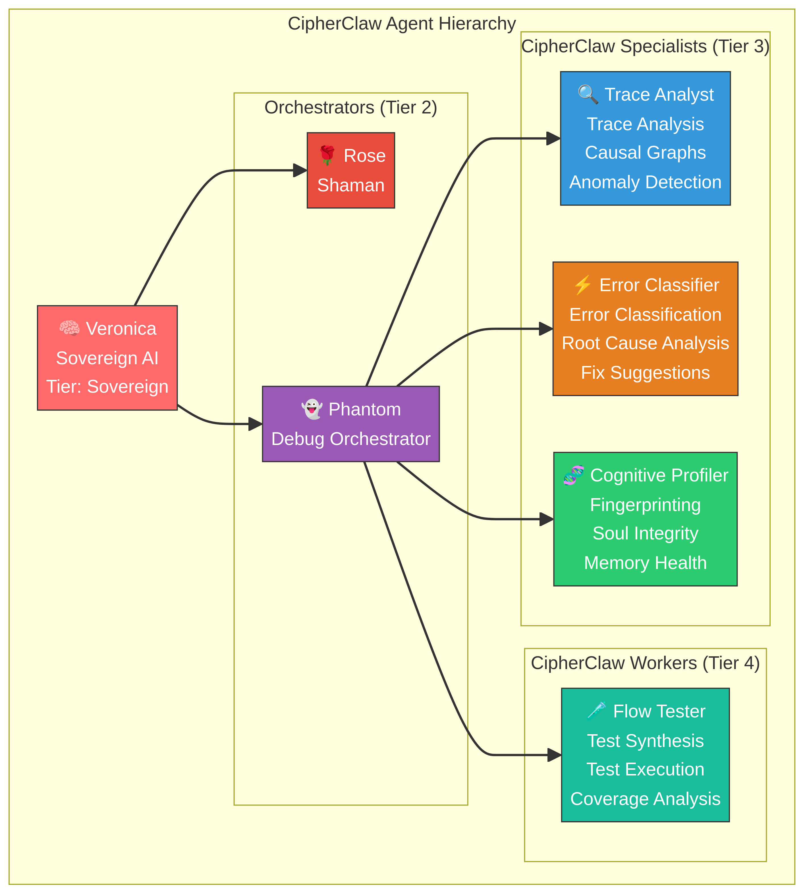

<p align="center">
  
</p>

<h1 align="center">CipherClaw</h1>

<p align="center">
  <strong>The World's First OpenClaw Bug Hunter AI Agent</strong>
</p>

<p align="center">
  <a href="https://cipherclaw.com">Website</a> •
  <a href="#-10-patent-pending-capabilities">Patent Claims</a> •
  <a href="#-quick-start">Quick Start</a> •
  <a href="#-architecture">Architecture</a> •
  <a href="#-api-reference">API Reference</a> •
  <a href="docs/PATENT.md">Patent Specification</a> •
  <a href="docs/ARCHITECTURE.md">Technical Spec</a> •
  <a href="CONTRIBUTING.md">Contributing</a>
</p>

<p align="center">
  
  
  
  
  
</p>

---

<p align="center">
  
</p>

---

## What is CipherClaw?

**CipherClaw** is a state-of-the-art, patent-pending AI agent debugging platform built on the [OpenClaw](https://github.com/VoltAgent/awesome-openclaw-skills) architecture. It introduces **10 novel capabilities** that no existing debugging tool provides — making it the most advanced agent debugger in the world.

CipherClaw operates as an autonomous debug agent ("Phantom") within the [ClawLI.AI](https://clawli.ai) platform, reporting to the Sovereign AI (Veronica) alongside the Shaman Orchestrator (Rose). It can debug any OpenClaw-compatible agent system across multiple domains: **Agent Command Center**, **CRM Pipeline**, **Content/Social Media**, and **Memory Systems**.

> **"CipherClaw doesn't just find bugs — it predicts them, traces their causes, fingerprints the agents involved, and heals itself while doing it."**

---

## 🔟 10 Patent-Pending Capabilities

Every capability below is a **novel invention** not found in any existing debugging platform. See the full [Patent Specification](docs/PATENT.md) for detailed claims.

| # | Capability | Description | Status |
|---|-----------|-------------|--------|
| 1 | **[Causal Debug Graph](#1-causal-debug-graph)** | Automatically constructs DAGs of error propagation with root cause probability scoring | Patent Pending |
| 2 | **[Cognitive Fingerprinting](#2-cognitive-fingerprinting)** | Profiles agent behavioral patterns and detects cognitive drift from baseline | Patent Pending |
| 3 | **[Hierarchical Debug Propagation](#3-hierarchical-debug-propagation)** | Routes debug events through multi-tier agent command structures | Patent Pending |
| 4 | **[Multi-Tier Memory Debugging](#4-multi-tier-memory-debugging)** | Analyzes health across sensory, working, episodic, semantic, and procedural memory | Patent Pending |
| 5 | **[Predictive Failure Engine](#5-predictive-failure-engine)** | Anticipates system failures before they occur using pattern recognition | Patent Pending |
| 6 | **[Soul Integrity Monitoring](#6-soul-integrity-monitoring)** | Verifies agent personality and value adherence over time | Patent Pending |
| 7 | **[Cross-Domain Correlation](#7-cross-domain-correlation)** | Detects shared failure patterns across agent, CRM, content, and infra domains | Patent Pending |
| 8 | **[Self-Debugging Agent Loop](#8-self-debugging-agent-loop)** | The debug system monitors and repairs its own operation | Patent Pending |
| 9 | **[Flow Test Synthesis](#9-flow-test-synthesis)** | Automatically generates integration tests from observed execution traces | Patent Pending |
| 10 | **[Temporal Anomaly Cascade Detection](#10-temporal-anomaly-cascade-detection)** | Identifies cascading failure patterns within configurable time windows | Patent Pending |

---

## 🏗 Architecture

<p align="center">
  
</p>

### Agent Hierarchy

CipherClaw operates as a first-class orchestrator within the ClawLI.AI agent hierarchy:

<p align="center">
  
</p>

```
Veronica (Sovereign AI)
├── Rose (Shaman Orchestrator)
│   └── ... (CRM, Content, Social agents)
└── Phantom (Debug Orchestrator) ← CipherClaw
    ├── Trace Analyst (Specialist)
    ├── Error Classifier (Specialist)
    ├── Cognitive Profiler (Specialist)
    └── Flow Tester (Worker)
```

### Debug Session Flow

<p align="center">
  
</p>

### Causal Debug Graph

<p align="center">
  
</p>

For the complete technical architecture, see [ARCHITECTURE.md](docs/ARCHITECTURE.md).

---

## 🚀 Quick Start

### Installation

```bash
npm install cipherclaw
# or
pnpm add cipherclaw
# or
yarn add cipherclaw
```

### Basic Usage

```typescript
import { createCipherClaw } from 'cipherclaw';

// Create a CipherClaw instance
const cc = createCipherClaw();

// Start a debug session
const session = cc.startSession({ domain: 'agent' });

// Ingest traces from your agent system
cc.ingestTrace({
  id: 'trace-001',
  sessionId: session.id,
  agentId: 'my-agent',
  domain: 'agent',
  startTime: Date.now() - 5000,
  endTime: Date.now(),
  status: 'error',
  spans: [
    {
      id: 'span-1',
      traceId: 'trace-001',
      name: 'agent.plan',
      category: 'planning',
      startTime: Date.now() - 5000,
      endTime: Date.now() - 3000,
      durationMs: 2000,
      status: 'ok',
      agentId: 'my-agent',
      domain: 'agent',
      metadata: {},
      events: [],
    },
    {
      id: 'span-2',
      traceId: 'trace-001',
      name: 'agent.tool_call',
      category: 'action',
      startTime: Date.now() - 3000,
      endTime: Date.now(),
      durationMs: 3000,
      status: 'error',
      agentId: 'my-agent',
      domain: 'agent',
      metadata: { error: 'Tool timeout' },
      events: [{ type: 'error', message: 'Tool execution timed out', timestamp: Date.now() }],
    },
  ],
});

// Classify errors
const error = cc.classifyError('Tool execution timed out');
console.log(error.module);       // 'action'
console.log(error.severity);     // 'high'
console.log(error.suggestedFix); // 'Increase tool timeout or add retry logic'

// Get the causal graph
const graph = cc.getCausalGraph();
console.log(graph?.rootCauses);  // Nodes identified as root causes

// Compute cognitive fingerprint
const fp = cc.computeCognitiveFingerprint('my-agent');
console.log(fp.driftScore);      // 0-100 drift from baseline

// Run predictive failure analysis
const predictions = cc.getPredictions();
predictions.forEach(p => {
  console.log(`${p.predictedFailure}: ${(p.confidence * 100).toFixed(0)}% confidence`);
});

// Generate Veronica report
const report = cc.generateReport();
console.log(`Health Score: ${report.healthScore}/100`);
console.log(`Recommendations: ${report.recommendations.join(', ')}`);

// Complete the session
cc.completeSession();
```

### OpenClaw Integration

```typescript
import { CIPHERCLAW_MANIFEST, createCipherClaw } from 'cipherclaw';

// Register CipherClaw as an OpenClaw skill
const manifest = CIPHERCLAW_MANIFEST;
console.log(manifest.name);        // 'cipherclaw'
console.log(manifest.agents);      // 5 agent definitions
console.log(manifest.skills);      // 10 skill definitions
console.log(manifest.tools);       // 14 tool definitions
console.log(manifest.events);      // 12 event definitions

// Use the event system
const cc = createCipherClaw();
cc.on('error-classified', (event) => {
  console.log(`Error classified: ${event.payload.module} / ${event.payload.severity}`);
});
cc.on('anomaly-detected', (event) => {
  console.log(`Anomaly: ${event.payload.type}`);
});
cc.on('prediction-generated', (event) => {
  console.log(`Prediction: ${event.payload.confidence}% confidence`);
});
```

---

## 📖 API Reference

### `createCipherClaw(config?)`

Factory function that creates a new CipherClaw adapter instance.

```typescript
const cc = createCipherClaw({
  maxTraces: 10000,
  anomalyThresholdStdDev: 2.5,
  cascadeWindowMs: 30000,
  soulDriftThreshold: 15,
  enableSelfDebug: true,
  enableHierarchyPropagation: true,
});
```

### Session Management

| Method | Description | Returns |
|--------|-------------|---------|
| `startSession(opts?)` | Start a new debug session | `DebugSession` |
| `completeSession(id?)` | Complete and finalize a session | `DebugSession` |
| `getSession(id?)` | Get session by ID | `DebugSession` |
| `getAllSessions()` | Get all sessions | `DebugSession[]` |
| `pauseSession(id?)` | Pause a session | `void` |
| `resumeSession(id?)` | Resume a paused session | `void` |

### Trace Ingestion

| Method | Description | Returns |
|--------|-------------|---------|
| `ingestTrace(trace, id?)` | Ingest a complete trace | `void` |
| `ingestSpan(span, id?)` | Ingest a single span | `void` |

### Analysis

| Method | Description | Returns |
|--------|-------------|---------|
| `classifyError(msg, span?, id?)` | Classify an error | `ClassifiedError` |
| `getCausalGraph(id?)` | Get the causal debug graph | `CausalGraph` |
| `getRootCauses(id?)` | Get identified root causes | `CausalNode[]` |
| `computeCognitiveFingerprint(agentId, id?)` | Compute agent fingerprint | `CognitiveFingerprint` |
| `analyzeSoulIntegrity(agentId, soul, behavior, id?)` | Check soul adherence | `SoulIntegrityReport` |
| `analyzeMemoryHealth(state, id?)` | Analyze memory health | `MemoryHealthReport` |
| `detectAnomalies(spans, id?)` | Detect anomalies | `Anomaly[]` |
| `detectCrossDomainCorrelations(id?)` | Find cross-domain correlations | `CrossDomainCorrelation[]` |
| `getPredictions(id?)` | Get failure predictions | `FailurePrediction[]` |

### Flow Tests

| Method | Description | Returns |
|--------|-------------|---------|
| `synthesizeFlowTest(traceId, id?)` | Generate test from trace | `FlowTest` |
| `runFlowTests(domain?, id?)` | Run all flow tests | `FlowTestReport` |

### Breakpoints & Replay

| Method | Description | Returns |
|--------|-------------|---------|
| `addBreakpoint(type, condition?, meta?, id?)` | Add a breakpoint | `Breakpoint` |
| `removeBreakpoint(bpId, id?)` | Remove a breakpoint | `void` |
| `toggleBreakpoint(bpId, id?)` | Toggle breakpoint on/off | `void` |
| `captureSnapshot(id?)` | Capture state snapshot | `StateSnapshot` |
| `getSnapshots(id?)` | Get all snapshots | `StateSnapshot[]` |
| `replayToSnapshot(snapId, id?)` | Replay to a snapshot | `StateSnapshot` |

### Hierarchy

| Method | Description | Returns |
|--------|-------------|---------|
| `propagateDebugEvent(event, id?)` | Propagate debug event through hierarchy | `HierarchyDebugEvent` |

### Reports & Self-Debug

| Method | Description | Returns |
|--------|-------------|---------|
| `generateReport(id?)` | Generate Veronica debug report | `VeronicaDebugReport` |
| `selfDebug()` | Run self-diagnostics | `SelfDebugResult` |
| `getSelfDebugLog()` | Get self-debug history | `SelfDebugEntry[]` |

### Events

| Method | Description | Returns |
|--------|-------------|---------|
| `on(type, handler)` | Listen for specific event | `() => void` (unsubscribe) |
| `onAny(handler)` | Listen for all events | `() => void` (unsubscribe) |

### Event Types

| Event | Emitted When |
|-------|-------------|
| `session-started` | New debug session begins |
| `session-completed` | Debug session completes |
| `error-classified` | Error is classified |
| `anomaly-detected` | Anomaly is detected |
| `cascade-detected` | Cascading failure detected |
| `prediction-generated` | Failure predicted |
| `breakpoint-hit` | Breakpoint triggered |
| `soul-drift-detected` | Soul drift detected |
| `cognitive-drift-detected` | Cognitive drift detected |

---

## 🆚 Competitive Comparison

| Feature | CipherClaw | LangSmith | Maxim | Arize | Blinky | VoltAgent |
|---------|-----------|-----------|-------|-------|--------|-----------|
| Causal Debug Graph | ✅ | ❌ | ❌ | ❌ | ❌ | ❌ |
| Cognitive Fingerprinting | ✅ | ❌ | ❌ | ❌ | ❌ | ❌ |
| Hierarchy Propagation | ✅ | ❌ | ❌ | ❌ | ❌ | ❌ |
| Memory Tier Debug | ✅ | ❌ | ❌ | ❌ | ❌ | ❌ |
| Predictive Failure | ✅ | ❌ | ❌ | ❌ | ❌ | ❌ |
| Soul Integrity | ✅ | ❌ | ❌ | ❌ | ❌ | ❌ |
| Cross-Domain Correlation | ✅ | ❌ | Partial | ❌ | ❌ | ❌ |
| Self-Debugging | ✅ | ❌ | ❌ | ❌ | ❌ | ❌ |
| Flow Test Synthesis | ✅ | ❌ | ❌ | ❌ | ❌ | ❌ |
| Anomaly Cascades | ✅ | ❌ | ❌ | ❌ | ❌ | ❌ |
| OpenClaw Compatible | ✅ | ❌ | ❌ | ❌ | ❌ | ❌ |
| Multi-Domain | ✅ | ❌ | Partial | ❌ | ❌ | ❌ |
| Agent Hierarchy Aware | ✅ | ❌ | ❌ | ❌ | ❌ | ❌ |
| 11 Breakpoint Types | ✅ | ❌ | ❌ | ❌ | ❌ | ❌ |
| Time-Travel Replay | ✅ | ❌ | ❌ | ❌ | Partial | ❌ |

---

## 📁 Project Structure

```
CipherClaw/
├── src/
│   ├── index.ts                    # Main entry point — all exports
│   ├── types/
│   │   └── index.ts                # All TypeScript types and interfaces
│   ├── core/
│   │   └── engine.ts               # Core debug engine (1,400+ lines)
│   └── openclaw/
│       ├── manifest.ts             # OpenClaw skill manifest & agent defs
│       └── adapter.ts              # OpenClaw adapter with event system
├── docs/
│   ├── ARCHITECTURE.md             # Technical architecture specification
│   ├── PATENT.md                   # Patent specification with 10 claims
│   ├── assets/
│   │   ├── cipherclaw-logo.png     # Project logo
│   │   └── cipherclaw-banner.png   # GitHub banner
│   └── diagrams/
│       ├── architecture.mmd/.png   # System architecture diagram
│       ├── agent-hierarchy.mmd/.png # Agent hierarchy diagram
│       ├── causal-debug-graph.mmd/.png # CDG example diagram
│       └── debug-session-flow.mmd/.png # Session flow sequence diagram
├── CONTRIBUTING.md                 # Contribution guidelines
├── LICENSE                         # Apache 2.0
├── package.json                    # Package configuration
├── tsconfig.json                   # TypeScript configuration
└── README.md                       # This file
```

---

## 🤝 Contributing

We welcome contributions! Please see [CONTRIBUTING.md](CONTRIBUTING.md) for guidelines.

### Development

```bash
# Clone the repo
git clone https://github.com/Alexi5000/CipherClaw.git
cd CipherClaw

# Install dependencies
pnpm install

# Build
pnpm build

# Run tests
pnpm test

# Type check
pnpm typecheck
```

---

## 📜 License

CipherClaw is licensed under the [Apache License 2.0](LICENSE).

---

## 🔗 Links

- **Website:** [cipherclaw.com](https://cipherclaw.com)
- **GitHub:** [github.com/Alexi5000/CipherClaw](https://github.com/Alexi5000/CipherClaw)
- **ClawLI.AI:** [clawli.ai](https://clawli.ai)
- **Patent Specification:** [docs/PATENT.md](docs/PATENT.md)
- **Architecture:** [docs/ARCHITECTURE.md](docs/ARCHITECTURE.md)

---

<p align="center">
  <strong>Built with 🔮 by <a href="https://clawli.ai">ClawLI.AI</a></strong>
</p>

<p align="center">
  <em>CipherClaw — Because bugs can't hide from a phantom with a claw.</em>
</p>
